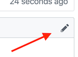

# This is a markdown text file

It's not code, it's plain text. You can document anything this way, from a brief note, through to writing a whole book.

You're welcome to **edit** this file to learn how the process works! Anyone can propose an edit!

You can do formatting in markdown documents even though it's plain text. For example, by putting `**` around the next words: **this is now bold**.

I think we should add a whole new line here like this.

## How to edit this file

1. Click the Edit icon (pencil) in the top right. 
2. Make your changes using the on-screen editor.
3. At the bottom of the editor screen you'll see:
    1. Write a one line summary of what changed, i.e. _"testing out editing"_
    2. Commit directly to the `yourusername-branch-1` branch.
    3. Push the big green button.
4. That's create a what's called a _Pull Request_, which is just a name for "proposed a change".
5. That takes you to the Pull Request page and you can write a note. "I'm making this change to understand how editing on GitHub works. Can you review my change, and if you agree with the edits I made, merge them in to the master document?"
